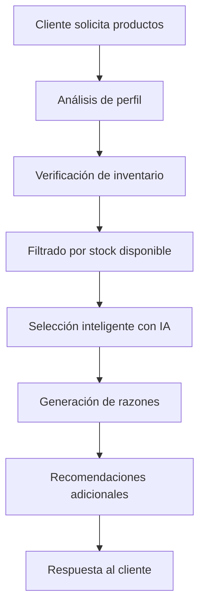

# Selección Inteligente de Productos - LibreriaIA

## 🎯 Descripción

Sistema de selección inteligente de productos que utiliza IA para recomendar los mejores productos del inventario real, considerando las características específicas del cliente y la disponibilidad de stock.

## 🚀 Características Principales

### 1. **Análisis de Perfil del Cliente**
- **Edad**: Para recomendar productos apropiados
- **Grado escolar**: Primaria, Secundaria, Universidad, etc.
- **Intereses**: Matemáticas, arte, tecnología, etc.
- **Presupuesto**: Bajo, medio, alto
- **Preferencias**: Calidad, durabilidad, marca, etc.

### 2. **Verificación de Inventario Real**
- ✅ Solo productos con stock disponible
- ✅ Verificación de cantidades solicitadas
- ✅ Información de precios actualizada
- ✅ Categorías y marcas reales

### 3. **Selección Inteligente con IA**
- 🤖 Análisis contextual del cliente
- 🎯 Recomendaciones personalizadas
- 💡 Razones de selección explicadas
- 🔄 Fallbacks automáticos

### 4. **Recomendaciones Adicionales**
- 📦 Productos complementarios
- 🎁 Sugerencias basadas en perfil
- 💰 Optimización de presupuesto

## 📋 API Endpoints

### 1. **Selección Inteligente de Productos**
```http
POST /api/ai/seleccionar-productos
```

**Body:**
```json
{
  "clientProfile": {
    "age": 15,
    "grade": "Secundaria",
    "interests": "Matemáticas, dibujo técnico",
    "budget": "medio",
    "preferences": "Calidad intermedia, durabilidad"
  },
  "requestedItems": [
    {
      "name": "lápiz",
      "quantity": 5
    },
    {
      "name": "cuaderno",
      "quantity": 2
    },
    {
      "name": "calculadora",
      "quantity": 1
    }
  ],
  "qualityPreference": "intermedio"
}
```

**Response:**
```json
{
  "success": true,
  "result": {
    "selected_products": [
      {
        "id": "product-id",
        "name": "Lápiz Grafito HB Ecológico",
        "price": 1500,
        "stock": 50,
        "category": "Escritura",
        "brand": "Faber-Castell",
        "quantity_selected": 5,
        "reasoning": "Ideal para estudiantes de secundaria, ecológico y duradero"
      }
    ],
    "unavailable_items": [
      {
        "name": "calculadora científica",
        "quantity": 1,
        "reason": "Stock insuficiente. Máximo disponible: 0"
      }
    ],
    "recommendations": [
      {
        "item": "lápiz",
        "reasoning": "Seleccionado por ser ecológico y apropiado para la edad"
      }
    ],
    "additional_recommendations": [
      {
        "product": {
          "id": "product-id-2",
          "name": "Compás de dibujo",
          "price": 2500,
          "stock": 10,
          "category": "Geometría"
        },
        "reasoning": "Perfecto para dibujo técnico que mencionaste en tus intereses"
      }
    ]
  },
  "ai_provider": "Google Generative AI (Gemini) - Optimizado",
  "tokens_optimized": true,
  "inventory_checked": true,
  "client_profile_analyzed": true
}
```

### 2. **Inventario Analizado**
```http
GET /api/ai/inventario-analizado?category=Escritura&minStock=5&maxPrice=5000
```

**Response:**
```json
{
  "success": true,
  "inventory": [
    {
      "id": "product-id",
      "name": "Lápiz Grafito HB",
      "price": 1500,
      "stock": 50,
      "category": "Escritura",
      "brand": "Faber-Castell"
    }
  ],
  "total_products": 25,
  "analysis": {
    "most_common_category": "Escritura",
    "most_expensive": "Calculadora científica avanzada",
    "cheapest": "Goma de borrar",
    "total_products": "25",
    "general_recommendation": "Buena variedad de productos escolares"
  },
  "ai_provider": "Google Generative AI (Gemini) - Optimizado",
  "tokens_optimized": true
}
```

## 🛠️ Uso del Sistema

### 1. **Configuración del Cliente**

El sistema analiza el perfil del cliente para hacer recomendaciones personalizadas:

```javascript
const clientProfile = {
  age: 15,                    // Edad del estudiante
  grade: "Secundaria",        // Nivel educativo
  interests: "Matemáticas, dibujo técnico", // Intereses específicos
  budget: "medio",            // Presupuesto disponible
  preferences: "Calidad intermedia, durabilidad" // Preferencias
};
```

### 2. **Items Solicitados**

Los productos que el cliente necesita:

```javascript
const requestedItems = [
  {
    name: "lápiz",           // Nombre del producto
    quantity: 5              // Cantidad requerida
  },
  {
    name: "cuaderno",
    quantity: 2
  }
];
```

### 3. **Procesamiento Inteligente**

El sistema:

1. **Verifica inventario**: Solo productos con stock disponible
2. **Analiza perfil**: Considera edad, grado, intereses
3. **Selecciona productos**: Usa IA para elegir los mejores
4. **Genera razones**: Explica por qué cada selección
5. **Sugiere adicionales**: Productos complementarios

## 🧪 Pruebas

### Script de Prueba Automático
```bash
npm run test:smart
```

### Pruebas Manuales
```bash
# Selección inteligente
curl -X POST http://localhost:3000/api/ai/seleccionar-productos \
  -H "Content-Type: application/json" \
  -d '{
    "clientProfile": {
      "age": 15,
      "grade": "Secundaria",
      "interests": "Matemáticas, dibujo técnico"
    },
    "requestedItems": [
      {"name": "lápiz", "quantity": 5},
      {"name": "cuaderno", "quantity": 2}
    ],
    "qualityPreference": "intermedio"
  }'

# Inventario analizado
curl http://localhost:3000/api/ai/inventario-analizado?category=Escritura
```

## 📊 Flujo de Trabajo



## 🔧 Configuración Avanzada

### Personalizar Prompts de IA

```javascript
// En services/aiService.js - método selectBestProductWithAI
const prompt = `Cliente: ${clientProfile.age || 'N/A'} años, ${clientProfile.grade || 'N/A'}, ${clientProfile.interests || 'N/A'}. 
Necesita: ${item.name} (${item.quantity} unidades). Calidad: ${qualityPreference}.
Productos disponibles:
${productsInfo}

Selecciona el MEJOR producto considerando edad, grado escolar, intereses y calidad. Responde: ID|razón.`;
```

### Ajustar Criterios de Selección

```javascript
// En services/aiService.js - método selectBestProductWithRules
const sortedProducts = availableProducts.sort((a, b) => {
    // Priorizar stock suficiente
    if (a.stock >= item.quantity && b.stock < item.quantity) return -1;
    if (a.stock < item.quantity && b.stock >= item.quantity) return 1;
    
    // Luego por precio
    return a.price - b.price;
});
```

## 💡 Casos de Uso

### 1. **Estudiante de Primaria (8 años)**
- **Intereses**: Arte, manualidades
- **Productos recomendados**: Lápices de colores, cuadernos de dibujo, tijeras escolares
- **Razón**: Productos seguros y apropiados para la edad

### 2. **Estudiante de Secundaria (15 años)**
- **Intereses**: Matemáticas, dibujo técnico
- **Productos recomendados**: Calculadora científica, compás, escuadras
- **Razón**: Herramientas específicas para materias técnicas

### 3. **Estudiante Universitario (20 años)**
- **Intereses**: Programación, diseño
- **Productos recomendados**: USB, calculadora avanzada, cuadernos profesionales
- **Razón**: Productos de mayor calidad para uso profesional

## 🚨 Consideraciones Importantes

### Stock y Disponibilidad
- ✅ Solo productos con stock > 0
- ✅ Verificación de cantidades solicitadas
- ✅ Información de stock máximo disponible
- ⚠️ Alertas cuando no hay stock suficiente

### Optimización de Tokens
- 💰 Prompts optimizados para menor uso de tokens
- 🔄 Cache de recomendaciones
- 📊 Límites en número de productos analizados

### Fallbacks
- 🤖 IA disponible: Selección inteligente
- 📋 IA no disponible: Selección por reglas
- ❌ Sin inventario: Mensaje informativo

## 🔮 Próximas Mejoras

1. **Aprendizaje de Preferencias**: Recordar elecciones previas del cliente
2. **Análisis de Tendencias**: Productos más populares por perfil
3. **Optimización de Precio**: Recomendaciones por presupuesto
4. **Integración con Compras**: Actualización automática de stock
5. **Recomendaciones Estacionales**: Productos según época del año

---

**¡La selección inteligente está lista para usar!** 🎉

El sistema ahora puede analizar perfiles de clientes y seleccionar los mejores productos del inventario real, considerando stock disponible y características personalizadas. 